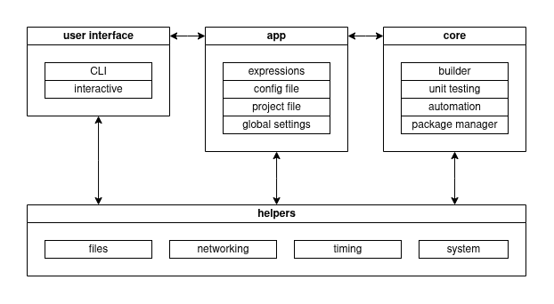
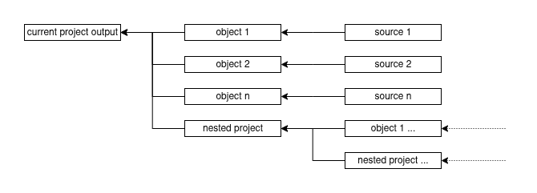

# High level design



# User interface

## CLI

The purpose is to allow user to use the Sea in his CI/CD pipelines. Should handle next cases:

1. Help.
2. Build debug version of the project binary.
3. Build release version of the project binary.
4. Run tests.
5. Run custom user automation script.
6. Specify the sea project file if needed.

## Interactive

This interface need to control and setup the project. Should handle next cases:

1. Build debug version of the project binary.
2. Build release version of the project binary.
4. Run tests.
5. Run custom user automation script.
6. Change the project name and version.
7. Change the project definitions.
8. Change the project include paths.
9. Install and manage libraries and tools from the repository in the current project.
10. Manage the user-defined variables of the project.
11. Specify the sea project file if needed.

# App

This part manages all user interface and core components. The only component, that have it's inner control logic.

The sea lifecycle, briefly:

1. Parse CLI commands with user interface CLI component. Decide what to do.
2. Find and read global config file, update the global settings.
3. Find and read local project file, update the global settings.
4. Start the interactive mode or do what the user requested with CLI arguments.
5. Catch the interactive mode requests and handle it.
6. Exit at the job end in case of CLI command, or when user quits with interactive mode.

## Expressions

The expression engine converts the one string to another, extracting the values of user-defined variables and global settings.

## Config file

Config file located at the home directory and named as `.searc`. It have the simple ini format, and contains settings for the program.

User may edit it how he want, but the primary way to edit it is the sea interactive mode.

## Project file

Sea no needed scripts itself, but the project still need to store the information about it. The project file contains specific information for the project and may override some variables from the global config file if needed. The format of this file is simple ini and should have extension `.sea`. Each directory can contain several project file, but in this case sea would process exactly one file at a time.

Project file may contain:
1. Packages required for the project
2. Global macro definitions
3. Global include and library directories
4. The project name and version
5. User-defined variables.

## Global settings

Global settings is a key-value storage. Information from global config and project files should be placed exactly here.

# Core

## Builder

Builds the project. As input gives the necessary information for build:

1. Compiler, linker, archiver, etc location and their types: gcc/clang/msvc/other.
2. Macro definitions to apply it for all of the files to process.
3. Include directories to apply it for all of the files to process.
4. The project type: static or shared library, executable.
5. The build scheme: release or debug.

Next stage, the builder recursively scans the directory for the source files and nested sea project files, and prepares a build tree. Builder skips unknown files and and tests.



Then builder start to traverse build tree from the leafs to the roots. The most important decision is process this node or not. Checklist to find it out:

1. Does the leaves of this node were changed or processed? Process the node if yes.
2. Does the current node object already exist? Process the node if no.
3. Does the current object obsolete? Process the node if yes.

Each leaf type processed the own way:
1. Project node collect the objects in executable, shared or static library.
2. Object nodes should be built from the sources.
3. Sources should be just checked for their dependencies and if they were changed since the time.

To check out the source dependencies, entire file is scanned for `include` statement. Builder search all of the inclusions and checks their state. It's a recursive process.

Builder also checks the special comments for explicit dependencies for the files, for example for templates or other binaries that used directly in this file:

```
// Depends on: "<name of the file>"
/* Depends on: "<name of the file>" */
```

Builder ignores the missing inclusions, letting this job to compiler.

According to type of tooling, builder composes the command string and invokes the corresponding program. 

## Unit testing

Unit tests for the sea are just source code files that have name prefix `test.`. Each unit test should have the main function and return 0 if success and any other value when the test failed.

Unit testing have it's own preprocessor that may copy in-place part of the any source. After preprocessing is done, the new test file is generated and it should be compiled. User selects with the special comment the source code file and the name of the object inside it to copy and paste inside the test's source.

## Automation

There's limited scripting support enough to automate some actions in platform-independent way. Scripting language supports:

- expression evaluation
- filesystem operations

## Package Manager

Package manager installs tooling and libraries to use in the project. It loads zip files via http from the server and first saves it to the cache storage. Next it unpacks the package from the cache directly to the projects '.package' directory.

Each package can include binaries, source code and simple description with necessary macro definitions, includes, libraries and so on, that would be appended to the current project settings. These settings are located in the 'desc' file in the root of the package. This file have a simple ini format.

Packages should be independent solutions and dependencies are allowed (but not welcomed) for other packages in repository.

Repository should have the package list in the root, that contains the package name and checksum of the zip archive. Names of files should have the same name without extension as mentioned in the list. Finally, the package list file ends with arc above.

Sea is able to generate this package list for any directory with archives to ease the managing of the custom repository. Also it may operate with the local repositories on filesystem.

As the input, package manager requires:
1. List of the packages to be installed in the current project.
2. Path to the cache directory.
3. List of the remote and local repositories.

Package manager should not update the dependencies without explicit user request.

# Helpers

These utilities are used commonly in the all other parts of the application. The main purpose is to separate the system-related code and improve portability.

## Files

It's a set of the utilities, emulating standard Linux commands to interact with filesystem.

## Networking

For now, the only network behavior should be implemented is curl-like http download.

## Timing

Just set of convenient adaptors of stl and stdlib time and date functions.

## System

Emulation of the system utilities, such as stream editor, convenient regex adapters.

# Common design principles

1. Each block on the functional diagram is a separate module.
2. All of the modules should be represented as a single instance.
3. Module interface should be a set of functions.
4. Only simple types are allowed in the module interface. Structures and classes are not welcome.
5. Each module is independent and standalone. The only allowed dependency is `helpers`.